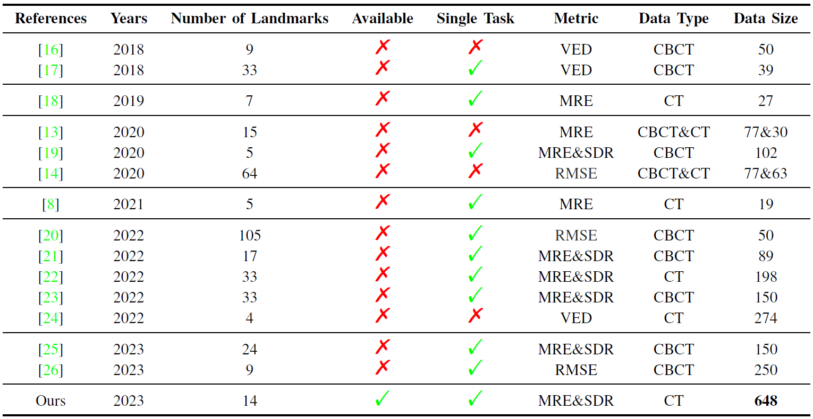

# A Largescale Benchmark Dataset for Evaluating 3D Skull Landmark Detection


## 1. Introduction
### 1.1 What for?

In this work, we have identified two limitations that hinder the domain of 3D skull landmark detection:
* 1. The lack of a standard benchmark dataset to evaluate the performance of automatic landmark detection models is a significant constraint. Through a review of advanced models from 2018 to 2023, listed in the Table, it was found that these models were trained on private datasets with variable data sizes, types, evaluation metrics, and numbers of landmarks.


* 2. the majority of studies collected data only during pre or postoperative stages. However, in a real-world clinical environment, the model must be robust enough to meet clinical demands with diverse data. Conducting a clinical landmarking evaluation is necessary in both pre and postoperative stages. Unfortunately, most models only focus on identifying a fixed number of landmarks on standard CT or CBCT volumes. 


- **The references can be find in our paper (coming soon)!

The project of Mandibular Molar Landmarking (MML) aims to identify the anatomy locations of the second and third mandibular molars' crowns and roots. The task has two main challenges:

* Mandibular molars have different root numbers because of molars' variant growth.

    

* Mandibular molars can be damaged by dental diseases, trauma, or surgery.

    

  
### 1.2 HighLights
* We created a large-scale benchmark dataset consisting of 648 CT volumes for evaluating 3D skull landmark detection. This dataset is publicly available and is, to the best of our knowledge, the largest public dataset.
* MML requires models that are robust in clinical environments and are capable of detecting arbitrary landmarks on pre-operative or post-operative CT volumes, meeting real clinical needs.
* We compared baseline deep learning methods in three aspects: landmark regression models, training losses, neural network structures. An ABR model inspired by YOLOV3 surpassed other baselines. The model combines landmark regression and classification losses for network training, resulting in better performance than the usual heatmap and offset regression methods.


## 2. Preparation
### 2.1 Requirements
- python >=3.7
- pytorch >=1.10.0
- Cuda 10 or higher
- numpy
- pandas
- scipy
- nrrd
- time

### 2.2 Data Preparation
<!The dataset will be available soon!>
The dataset is available at https://drive.google.com/file/d/1NGsBbqXZLDlkiSJtDQdyMlXzgnkFoVON/view?usp=sharing>
* Data division
```
    - mmld_dataset/train     # 458 samples for training
    - mmld_dataset/val       # 100 samples for validation
    - mmld_dataset/test      # 100 samples for testing
```
* Data format
```
    - *_volume.nrrd     # 3D volumes
    - *_label.npy       # landmarks
    - *_spacing.npy     # CT spacings, used for calculating MRE
```

## 3. Train and Test
### 3.1 Network Training 

* Training with different network backbones
```
python main_yolol.py --model_name PVNet               # network training using backbone PVNet
python main_yolol.py --model_name PUNet3D             # network training using backbone PUNet3D
python main_yolol.py --model_name PResidualUNet3D     # network training using backbone PResidualUNet3D
``` 

* Training with different GPUs
```
python main_yolol.py --gpu 0         # training with 1 gpu
python main_yolol.py --gpu 0,1,2,3   # training with 4 gpus
```

### 3.2 Fine-tuning in a pretrained checkpoint
```
python main_yolol.py --resume ../SavePath/yolol/model.ckpt
```

### 3.3 Metric counting
```
python main_yolol.py --test_flag 0 --resume ../SavePath/yolol/model.ckpt  # calculate MRE and SDR in validation set
python main_yolol.py --test_flag 1 --resume ../SavePath/yolol/model.ckpt  # calculate MRE and SDR in test set
```

### 3.4 Training baseline heatmap regression model
```
python main_baseline.py   # network training for baseline heatmap regression model 
```

## 4. Leadboard (Update 2023/06/15)

### The ACC, F1, MRE, and SDR on the MINI subset.

| **Models**   | **ACC (%)** | **F1 (%)** | **MRE±Std (mm)** | **SDR-2mm (%)** | **SDR-2.5mm (%)** | **SDR-3mm (%)** | **SDR-4mm (%)** |
| :----------- | :---------- | :--------- | :--------------- | :-------------- | :---------------- | :-------------- | :-------------- |
| Our Baseline | 93.04%      | 94.98      | 2.26±1.26        | 61.89           | 74.86             | 82.43           | 91.89           |
|              |             |            |                  |                 |                   |                 |                 |
|              |             |            |                  |                 |                   |                 |                 |
|              |             |            |                  |                 |                   |                 |                 |


### The MRE and SDR on the whole dataset.


| **Models**   | **MRE±Std (mm)** | **SDR-2mm (%)** | **SDR-2.5mm (%)** | **SDR-3mm (%)** | **SDR-4mm (%)** |
| :----------- | :--------------- | :-------------- | :---------------- | :-------------- | :-------------- |
| Our Baseline | 1.70±0.72        | 76.43           | 86.45             | 90.91           | 95.20           |
|              |                  |                 |                   |                 |                 |
|              |                  |                 |                   |                 |                 |
|              |                  |                 |                   |                 |                 |


## 5. Contact


Institution: Intelligent Medical Center, Sichuan University

email: tao_he@scu.edu.cn; taohescu@gmail.com

## 6. Citation (coming soon)

